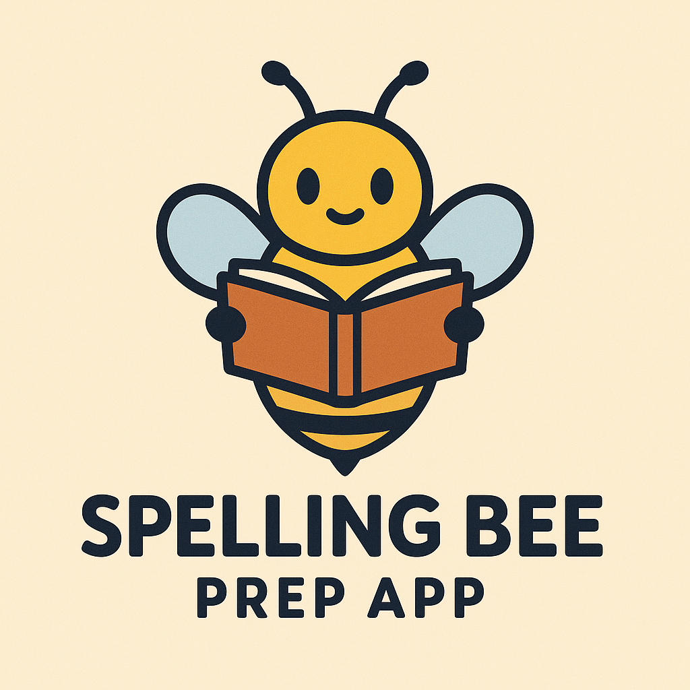

# Spelling Bee Prep

  

*Automatically synced with your [v0.dev](https://v0.dev) deployments*

## Overview

This repository will stay in sync with your deployed chats on [v0.dev](https://v0.dev).
Any changes you make to your deployed app will be automatically pushed to this repository from [v0.dev](https://v0.dev).

## Privacy & Data Storage

**🔒 Privacy First**: This web-based app is designed with your privacy in mind. All user data, including word lists, practice sessions, and progress, is stored locally in your browser using IndexedDB. No personal information is ever sent to or stored on any external servers.

**📱 Local Storage**: Your spelling practice data, saved word lists, and session history remain completely private and are only accessible on your device.

## Deployment

Your project is live at:

**[https://vercel.com/madarauchiha314s-projects/v0-spelling-bee-app](https://vercel.com/madarauchiha314s-projects/v0-spelling-bee-app)**

## Build your app

Continue building your app on:

**[https://v0.dev/chat/projects/0Elv7RJQUNP](https://v0.dev/chat/projects/0Elv7RJQUNP)**

## How It Works

1. Create and modify your project using [v0.dev](https://v0.dev)
2. Deploy your chats from the v0 interface
3. Changes are automatically pushed to this repository
4. Vercel deploys the latest version from this repository
